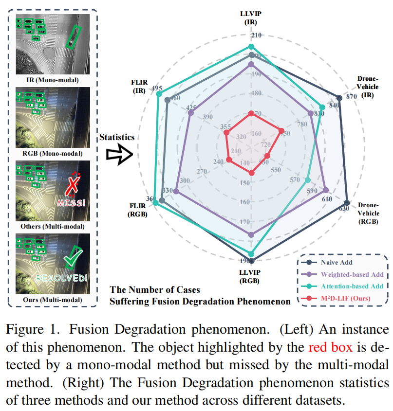
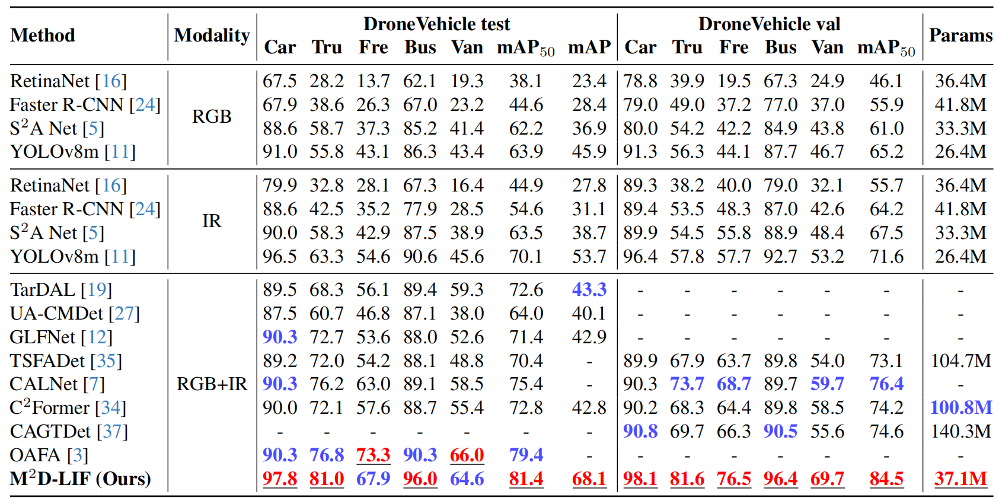
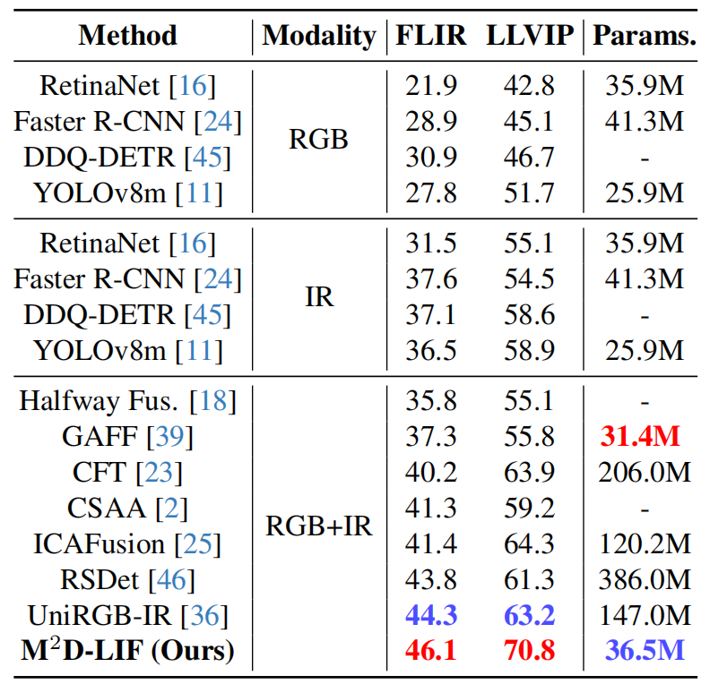

<p align="center"> <h1 align="center">Rethinking Multi-modal Object Detection from the Perspective of Mono-Modality Feature Learning</h1>
  <p align="center">
    <b> ICCV, 2025 </b>
    <br />
    <a href="https://github.com/Zhao-Tian-yi"><strong> Tianyi Zhao </strong></a>
    ·
    <a href=""><strong>Boyang liu </strong></a>
    ·
    <a href=""><strong>Yanglei Gao </strong></a>
    ·
    <a href="https://scholar.google.com.hk/citations?user=YSPWqbcAAAAJ&hl=en"><strong>Yiming Sun </strong></a>
    ·
    <a href="https://yuanmaoxun.github.io/"><strong>Maoxun Yuan</strong></a> 
      ·
    <a href="https://sites.google.com/site/xingxingwei1988/"><strong>Xingxing Wei</strong></a>
  </p>

  <p align="center">
    <a href='https://arxiv.org/abs/2503.11780'>
      
    </a>
    <a href='https://openaccess.thecvf.com/content/ICCV2025/html/Zhao_Rethinking_Multi-modal_Object_Detection_from_the_Perspective_of_Mono-Modality_Feature_ICCV_2025_paper.html'>
      
    </a>
<br />

This repository is the official Pytorch implementation for the paper [**Rethinking Multi-modal Object Detection from the Perspective of Mono-Modality Feature Learning**](https://openaccess.thecvf.com/content/ICCV2025/html/Zhao_Rethinking_Multi-modal_Object_Detection_from_the_Perspective_of_Mono-Modality_Feature_ICCV_2025_paper.html).

If you have any questions, please feel free to open an issue or contact me with emails: <ty_zhao@buaa.edu.cn>.
Any kind discussions are welcomed!

<h3 align="left">
Paper Links: 
<a href="https://openaccess.thecvf.com/content/ICCV2025/html/Zhao_Rethinking_Multi-modal_Object_Detection_from_the_Perspective_of_Mono-Modality_Feature_ICCV_2025_paper.html">ICCV 2025</a>, 
</h3>

**Please leave a <font color='orange'>STAR ⭐</font> if you like this project!**

# :fire:News
- ** Update on 2025/11/29:  The full code and the guidence readme file have been released **
- :fire: **Update on 2025/6/26: This work has been accepted by the top conference ICCV 2025 !**
- **Update on 2025/06/22: Release the M2D-LIF project repository.**

# :heart:Citation

If you find our work helpful for your research, please consider citing the following BibTeX entry.   

```bibtex
@InProceedings{Zhao_2025_ICCV,
    author= {Zhao, Tianyi and Liu, Boyang and Gao, Yanglei and Sun, Yiming and Yuan, Maoxun and Wei, Xingxing},
    title= {Rethinking Multi-modal Object Detection from the Perspective of Mono-Modality Feature Learning},
    booktitle = {Proceedings of the IEEE/CVF International Conference on Computer Vision (ICCV)},
    month= {October},
    year= {2025},
    pages= {6364-6373}
}
```


# :bookmark_tabs: Abstarct 

Multi-Modal Object Detection (MMOD), due to its stronger adaptability to various complex environments, has been widely applied in various applications. Extensive research is dedicated to the RGB-IR object detection, primarily focusing on how to integrate complementary features from RGB-IR modalities. **However, they neglect the mono-modality insufficient learning problem**, which arises from decreased feature extraction capability in multi-modal joint learning. This leads to a prevalent but unreasonable phenomenon\textemdash Fusion Degradation, which hinders the performance improvement of the MMOD model. Motivated by this, in this paper, we introduce linear probing evaluation to the multi-modal detectors and rethink the multi-modal object detection task from the mono-modality learning perspective. Therefore, we construct a novel framework called M2D-LIF, which consists of the Mono-Modality Distillation (M2D) method and the Local Illumination-aware Fusion (LIF) module. The M2D-LIF framework facilitates the sufficient learning of mono-modality during multi-modal joint training and explores a lightweight yet effective feature fusion manner to achieve superior object detection performance. Extensive experiments conducted on three MMOD datasets demonstrate that our M2D-LIF effectively mitigates the Fusion Degradation phenomenon and outperforms the previous SOTA detectors.




## :hammer:Environment Installation

```
git clone https://github.com/Zhao-Tian-yi/M2D-LIF.git
cd M2D-LIF
conda env create -f environment.yaml
conda activate M2D-LIF
```


## Datasets

 * FLIR
 * LLVIP
 * DroneVehicle 
### Dataset Organization Format

```
LLVIP_Mul/
├── images/
│   ├── train/
│   └── val/
├── images_ir/
│   ├── train/
│   └── val/
└── labels/
    ├── train/
    └── val/
```

! Corresponding files in each folder share the same base filename. All label files have been converted to the YOLO format to be compatible with the Ultralytics framework. Note that the detailed dataset descriptions can be found in the [YOLOV8]([ultralytics/ultralytics: Ultralytics YOLO 🚀](https://github.com/ultralytics/ultralytics)) documentation. 

## Weights

Model weights released at: https://pan.baidu.com/s/1GKDkfhJrKeskrnDNRzmFXw?pwd=vmvr

## Evaluation

1. After the environment and the dataset was downloaded, you can download the [checkpoint](##experiments-results) we supply.
2. change the dataset PATH in the dataset yaml file in ``./data``
3. change the PATH in the ``val.py`` or ``val_obb.py``  file,  including *model* and *data*. For example:

```python
# val.py
if __name__ == '__main__':
    model = YOLO(r"./your_ckpt_path/LLVIP/best_checkpoint.pt")
    data = r"./data/LLVIP.yaml"
    batch = 1
    device = 0
    imgsz = 640

    DEFAULT_CFG.save_dir = f"./runs/v8m/val"
    model.val(data=data, batch=batch, imgsz=imgsz, device=device, save=True, rect=True)
    
# val_obb.py
from ultralytics.models.yolo.obb import OBBValidator
if __name__ == '__main__':
    data = r"./data/DroneVehicle.yaml"

    args = dict(model="/your_ckpt_path/DroneVehicle.pt", 					
                data=data,
               	device=0,
                imgsz=640, batch=1, save=True, rect=True)
    validator = OBBValidator(args=args)
    validator(model=args["model"])
```

3. evaluation

   ```bash
   python val.py/val_obb.py
   ```


## Experiments Results

###  1. DroneVehicle



###  2. FLIR and LLVIP




## Contacts
Email: <ty_zhao@buaa.edu.cn>.


## Star History

[](https://www.star-history.com/#Zhao-Tian-yi/M2D-LIF&type=date&legend=top-left)


